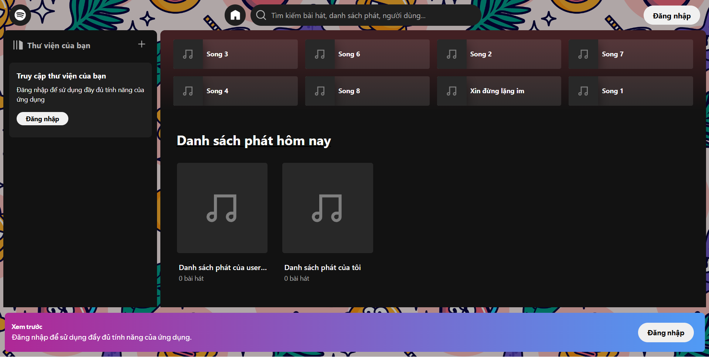
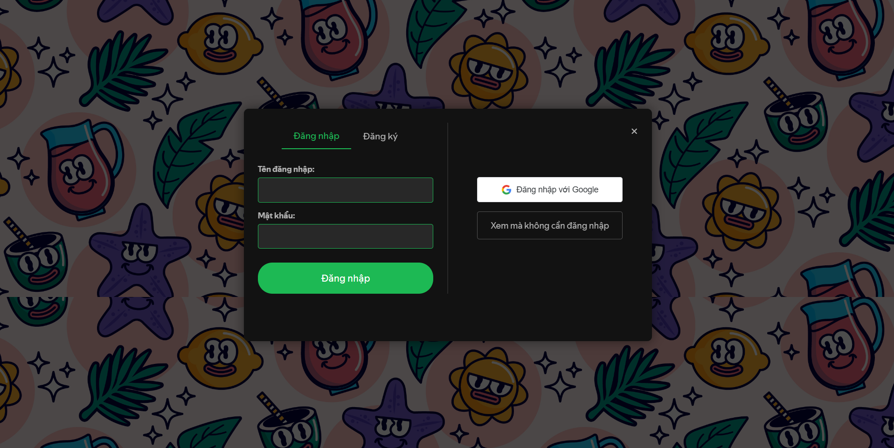
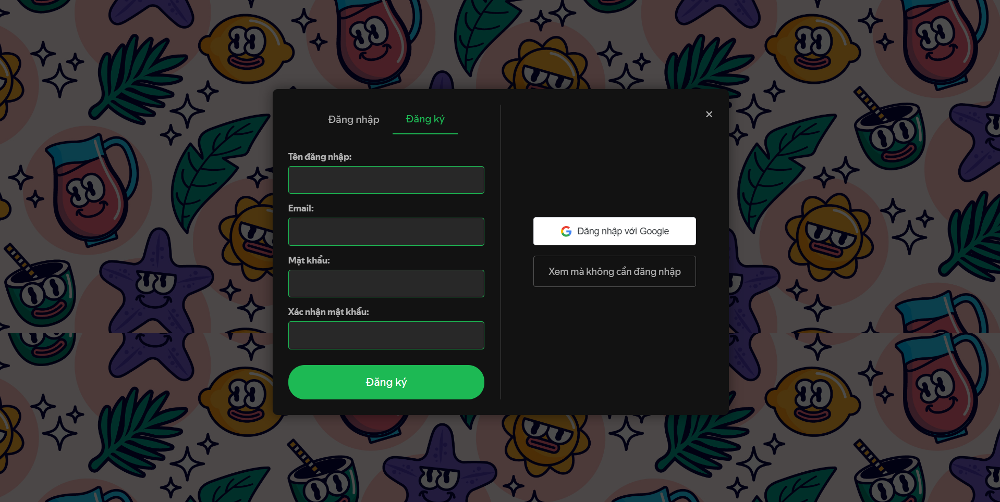
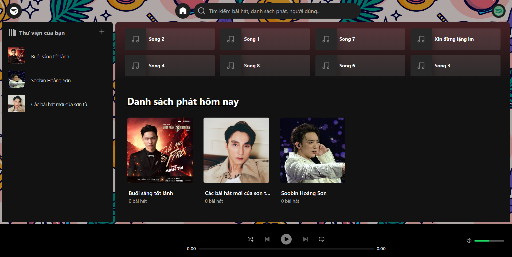
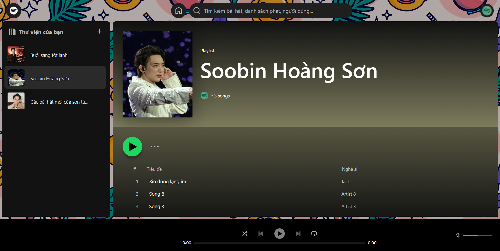
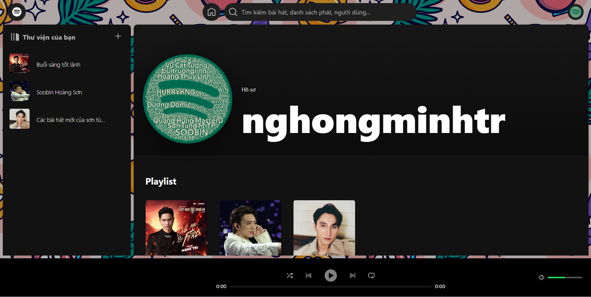
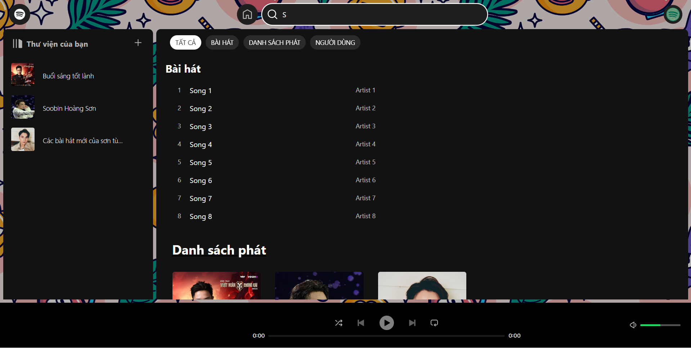
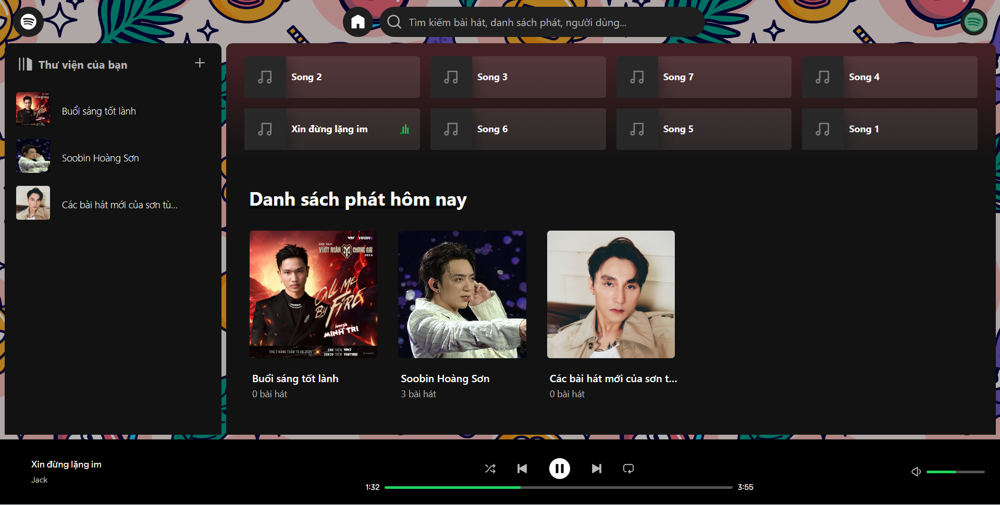

<div align="center">

# 🎵 Spotify Web UI Clone


**Giao diện web clone của Spotify — xây dựng bằng React & Vite**

[](https://react.dev/)
[](https://vitejs.dev/)
[](https://tailwindcss.com/)
[](https://ant.design/)
[](LICENSE)

[🔗 Backend Repository](https://github.com/MinhTriTech/spotify-backend-nodejs) · [📸 Xem Screenshots](#-screenshots) · [🚀 Bắt đầu](#-hướng-dẫn-cài-đặt)

</div>

---

## 📋 Mục lục

- [Giới thiệu](#-giới-thiệu)
- [Screenshots](#-screenshots)
- [Tính năng](#-tính-năng)
- [Công nghệ sử dụng](#-công-nghệ-sử-dụng)
- [Yêu cầu hệ thống](#-yêu-cầu-hệ-thống)
- [Hướng dẫn cài đặt](#-hướng-dẫn-cài-đặt)
- [Biến môi trường](#-biến-môi-trường)
- [Cấu trúc dự án](#-cấu-trúc-dự-án)
- [Backend Repository](#-backend-repository)
- [Đóng góp](#-đóng-góp)
- [Thành viên dự án](#-thành-viên-dự-án)
- [Liên hệ](#-liên-hệ)
- [Giấy phép](#-giấy-phép)

---

## 🎯 Giới thiệu

**Spotify Web UI Clone** là dự án **Frontend** tái tạo giao diện người dùng của Spotify. Dự án được xây dựng nhằm mục đích học tập và thực hành với các công nghệ web hiện đại như **React 19**, **Vite**, **Redux Toolkit** và **Tailwind CSS**.

> 💡 **Lưu ý:** Repository này chỉ chứa phần **Frontend**. Phần Backend được phát triển tách biệt tại [spotify-backend-nodejs](https://github.com/MinhTriTech/spotify-backend-nodejs).

> 🔄 Dự án này được lấy nguồn và tùy chỉnh từ [spotify-react-web-client](https://github.com/francoborrelli/spotify-react-web-client) của francoborrelli.

---

## 📸 Screenshots

### Trang chưa đăng nhập

<div align="center">
  
  
  
</div>

### Giao diện người dùng 

<div align="center">
  
</div>
<div align="center">
  
  
  
</div>
<div align="center">
  
</div>

> 📁 Xem toàn bộ ảnh trong [thư mục images](./images).

---

## ✨ Tính năng

### 👤 Tính năng người dùng

| Tính năng | Mô tả |
|-----------|-------|
| 🎵 **Quản lý playlist** | Tạo, chỉnh sửa và xóa playlist cá nhân |
| 🎧 **Phát nhạc & video** | Nghe nhạc, xem video với đầy đủ chức năng điều khiển |
| 👥 **Theo dõi nghệ sĩ** | Theo dõi hoặc hủy theo dõi nghệ sĩ yêu thích |
| 💬 **Nhắn tin** | Trò chuyện thời gian thực với bạn bè và người dùng khác |
| 🔍 **Tìm kiếm** | Tìm bài hát, album, nghệ sĩ và playlist |
| ⬇️ **Tải nhạc** | Tải bài hát yêu thích về thiết bị |
| 📹 **Tải video** | Xem và tải video âm nhạc |
| 🖼️ **Toàn màn hình** | Xem giao diện phát nhạc toàn màn hình |

### 🛡️ Tính năng Admin

| Tính năng | Mô tả |
|-----------|-------|
| 👮 **Quản lý người dùng** | Xem, phân quyền và quản lý tài khoản người dùng |
| 🎼 **Quản lý bài hát** | Thêm, sửa, xóa bài hát trong hệ thống |
| 💿 **Quản lý album** | Quản lý toàn bộ album và nội dung liên quan |
| 🎤 **Quản lý nghệ sĩ** | Thêm, sửa thông tin nghệ sĩ |
| 📋 **Quản lý playlist** | Quản lý danh sách phát của người dùng |
| 📊 **Thống kê** | Xem báo cáo và số liệu thống kê hệ thống |

---

## 🚀 Công nghệ sử dụng

| Nhóm | Công nghệ |
|------|-----------|
| **UI Framework** | React 19, React Router DOM v7 |
| **Build Tool** | Vite 6 |
| **UI Libraries** | Ant Design 5, Tailwind CSS 3, @ant-design/pro-form |
| **Styling** | SASS (sass-embedded), PostCSS, Autoprefixer |
| **Server State** | TanStack React Query v5 |
| **API Communication** | Axios, use-debounce |
| **Icons & Colors** | React Icons, ColorThief, TinyColor2 |
| **UX Components** | React Resizable Panels, React Infinite Scroll |
| **Authentication** | @react-oauth/google (OAuth Google) |
| **Code Quality** | ESLint, eslint-plugin-react-hooks, eslint-plugin-react-refresh |

---

## 🖥️ Yêu cầu hệ thống

Trước khi bắt đầu, hãy đảm bảo máy bạn đã cài đặt:

- **Node.js** >= 18.0.0 ([Tải tại đây](https://nodejs.org/))
- **npm** >= 9.0.0 (đi kèm với Node.js)
- **Git** ([Tải tại đây](https://git-scm.com/))

---

## 📦 Hướng dẫn cài đặt

### 1. Clone repository

```bash
git clone https://github.com/MinhTriTech/Spotify-Web-UI-Clone.git
cd Spotify-Web-UI-Clone
```

### 2. Cài đặt thư viện

```bash
npm install
```

### 3. Cấu hình biến môi trường

```bash
cp .env.example .env
```

Chỉnh sửa file `.env` với các giá trị phù hợp (xem [phần biến môi trường](#-biến-môi-trường)).

### 4. Chạy server phát triển

```bash
npm run dev
```

Ứng dụng sẽ chạy tại `http://localhost:5173`.

### 5. Build cho production

```bash
npm run build
```

### 6. Xem trước bản build

```bash
npm run preview
```

---

## 🔑 Biến môi trường

Tạo file `.env` ở thư mục gốc dự án với nội dung sau:

```env
# URL gốc của Backend (dùng cho API và tài nguyên media)
VITE_URL=http://localhost:8080

# Google OAuth Client ID (đăng ký tại https://console.cloud.google.com/)
VITE_GOOGLE_CLIENT_ID=your_google_client_id_here
```

> ⚠️ **Không commit file `.env` lên Git.** File này đã được thêm vào `.gitignore`.

---

## 📁 Cấu trúc dự án

```
Spotify-Web-UI-Clone/
├── public/                 # Tài nguyên tĩnh (favicon, ảnh public)
├── images/                 # Screenshots của ứng dụng
│   ├── User/               # Ảnh giao diện người dùng
│   └── Admin/              # Ảnh giao diện quản trị
├── src/
│   ├── components/         # Các component dùng chung
│   │   ├── Actions/        # Các nút hành động
│   │   ├── Layout/         # Layout components
│   │   ├── Lists/          # Danh sách (bài hát, album, ...)
│   │   ├── Modals/         # Hộp thoại modal
│   │   ├── player/         # Component trình phát nhạc
│   │   └── SongsTable/     # Bảng danh sách bài hát
│   ├── constants/          # Hằng số toàn cục
│   ├── context/            # React Context providers
│   ├── hooks/              # Custom React hooks
│   ├── layout/             # Cấu trúc layout trang
│   ├── pages/              # Các trang chính
│   │   ├── Home/           # Trang chủ
│   │   ├── Login/          # Trang đăng nhập
│   │   ├── Playlist/       # Trang playlist
│   │   ├── Profile/        # Trang cá nhân
│   │   └── Search/         # Trang tìm kiếm
│   ├── routes/             # Cấu hình routing
│   ├── services/           # Gọi API (Axios services)
│   ├── styles/             # File CSS/SCSS toàn cục
│   └── utils/              # Hàm tiện ích
├── .env.example            # Mẫu file biến môi trường
├── .gitignore
├── eslint.config.js        # Cấu hình ESLint
├── index.html              # Entry HTML
├── package.json
├── postcss.config.js       # Cấu hình PostCSS
├── tailwind.config.js      # Cấu hình Tailwind CSS
└── vite.config.js          # Cấu hình Vite
```

---

## 🔗 Backend Repository

Dự án này chỉ là phần **Frontend**. Để ứng dụng hoạt động đầy đủ, bạn cần kết hợp với phần **Backend**:

| | Thông tin |
|-|-----------|
| 📦 **Repository** | [spotify-backend-nodejs](https://github.com/MinhTriTech/spotify-backend-nodejs) (tác giả: MinhTriTech) |
| 🛠️ **Công nghệ** | Node.js, Express, MySQL |
| 🔌 **API Base URL** | `http://localhost:8080/api` (mặc định khi chạy local) |

> Hãy làm theo hướng dẫn cài đặt trong repository backend trước khi chạy frontend.

---

## 🤝 Đóng góp

Mọi đóng góp đều được hoan nghênh! Để đóng góp cho dự án:

1. **Fork** repository này
2. Tạo **branch** mới cho tính năng của bạn:
   ```bash
   git checkout -b feature/ten-tinh-nang
   ```
3. **Commit** các thay đổi:
   ```bash
   git commit -m "feat: mô tả tính năng"
   ```
4. **Push** lên branch của bạn:
   ```bash
   git push origin feature/ten-tinh-nang
   ```
5. Tạo **Pull Request** và mô tả chi tiết thay đổi của bạn

### Quy tắc commit message

Sử dụng [Conventional Commits](https://www.conventionalcommits.org/):

- `feat:` – Thêm tính năng mới
- `fix:` – Sửa lỗi
- `docs:` – Cập nhật tài liệu
- `style:` – Thay đổi về giao diện/style
- `refactor:` – Tái cấu trúc code
- `chore:` – Công việc bảo trì

---

## 📬 Liên hệ

Nếu bạn có bất kỳ câu hỏi hoặc góp ý nào, vui lòng liên hệ:

- 📧 **Email:** [hoangminhtri.ngo@gmail.com](mailto:hoangminhtri.ngo@gmail.com)
- 🐛 **Báo lỗi:** [Tạo Issue mới](https://github.com/MinhTriTech/Spotify-Web-UI-Clone/issues)

---

## 📄 Giấy phép

Dự án này được phân phối theo giấy phép **MIT**. Xem file [LICENSE](LICENSE) để biết thêm chi tiết.

---

<div align="center">

Cảm ơn bạn đã quan tâm đến dự án! ⭐ Hãy **star** nếu bạn thấy hữu ích nhé!

</div>
